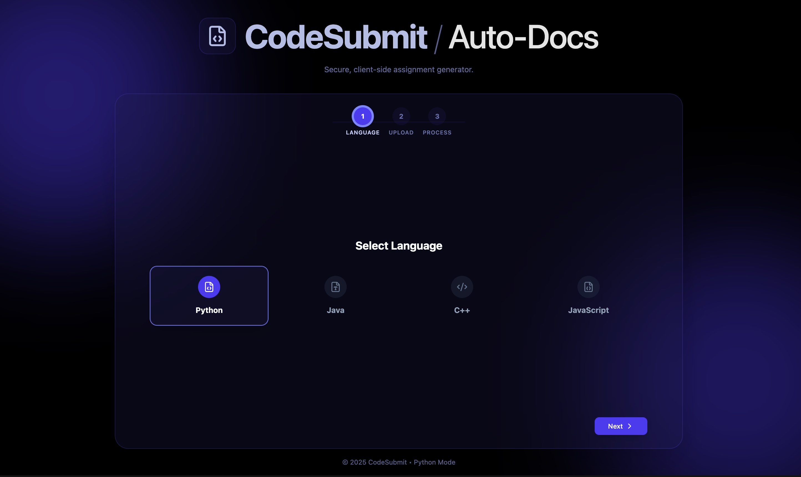

# CodeSubmit / Auto-Docs

**Secure, client-side assignment generator and execution environment.**

CodeSubmit is a modern web application designed to allow students to write, execute, and submit code assignments directly from the browser. It features a stunning, dynamic UI and supports multiple programming languages with client-side execution—ensuring security and speed without heavy server dependencies.


[](https://risa-org.github.io/code-submit-web/)

## 🚀 Features

- **🔒 Client-Side Execution**: Run code securely in the browser.
  - **Python**: Powered by [Pyodide](https://pyodide.org/) (WebAssembly).
  - **Java**: Powered by [CheerpJ](https://leaningtech.com/cheerpj/) (WebAssembly/JVM replacement).
  - **JavaScript**: Native browser execution sandboxing.
  - **C++**: (Beta) Client-side compile & run support.
- **📄 Auto-Docs Generation**: Automatically generates a formatted `.docx` file containing source code and execution outputs, ready for submission.
- **🎨 Dynamic Theming**: Immersive, monochromatic themes that switch instantly based on the selected language:
  - 🐍 **Python**: Deep Indigo
  - ☕ **Java**: Vibrant Orange
  - 📜 **JavaScript**: Energetic Yellow
  - ⚡ **C++**: Electric Cyan
- **⚡ Modern Tech Stack**: Built with React 19, Vite 7, and Tailwind CSS 4 for blazing fast performance.



## 🛠️ Tech Stack

- **Framework**: [React 19](https://react.dev/)
- **Build Tool**: [Vite 7](https://vitejs.dev/)
- **Styling**: [Tailwind CSS 4](https://tailwindcss.com/)
- **Icons**: [Lucide React](https://lucide.dev/)
- **Execution Engines**: Pyodide, CheerpJ
- **Utilities**: `docx` (Word generation), `clsx`, `tailwind-merge`

## 🏁 Getting Started

### Prerequisites

- **Node.js**: Version 18+ recommended.
- **npm**: (comes with Node.js).

### Installation

1.  **Clone the repository**:

    ```bash
    git clone https://github.com/your-username/code-submit-web.git
    cd code-submit-web
    ```

2.  **Install dependencies**:
    ```bash
    npm install
    ```

### Development

To start the local development server:

```bash
npm run dev
```

The app will be available at `http://localhost:5173`.

### Build

To create a production-ready build:

```bash
npm run build
```

The output will be in the `dist` directory.

## 📖 Usage Guide

1.  **Select Language**: Choose your programming language from the dashboard (Python, Java, C++, JS). The theme will adapt automatically.
2.  **Upload Files**: Drag & drop your source code files (`.py`, `.java`, etc.).
3.  **Run & Process**: Click the **Run** button. The app will execute your code (client-side) and capture the output.
4.  **Download Submission**: Once processing is complete, download the generated `.docx` file, which includes your code and the execution results.

## 🤝 Contributing

Contributions are welcome! Please feel free to submit a Pull Request.

1.  Fork the project
2.  Create your feature branch (`git checkout -b feature/AmazingFeature`)
3.  Commit your changes (`git commit -m 'Add some AmazingFeature'`)
4.  Push to the branch (`git push origin feature/AmazingFeature`)
5.  Open a Pull Request

## 📄 License

This project is licensed under the MIT License - see the LICENSE file for details.
